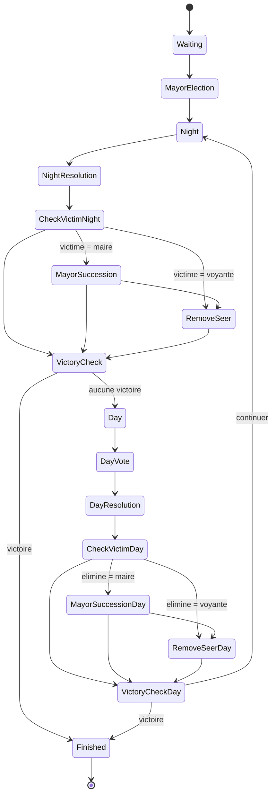

# WORKFLOW.md — Guide de reprise et de conduite du projet
> ⚠️ Fichier destiné au développeur uniquement.
> Claude Code ne doit pas lire ce fichier.

---

## 1. Vue d'ensemble — state machine v1.2

```
waiting
  ↓ start_election
electing_mayor
  ↓ start_night
night  ←──────────────────┐
  ↓ start_day             │ continue_night
day ────────────────────── ┘
  ↓ finish (depuis night ou day)
finished
```



Statuts intermédiaires (hors Workflow, gérés par les jobs) :
`role_reveal` · `processing_night` · `processing_wolves` · `wolves_turn` · `processing_day`

---

## 2. Avant chaque session Claude Code

1. **Régénérer `CODE_SNAPSHOT.md`** via le script externe : `./z_tools/project_structure.sh`
   → Index structurel du code. Sans lui, Claude Code lit 70 fichiers au lieu de 2-3.

2. **Ouvrir `TODO.md`** → identifier la prochaine étape `- [ ]`

3. **Ouvrir `TASK_PROMPTS_REMAINING.md`** → copier le prompt de l'étape suivante

4. **Lancer Claude Code** dans le dossier du projet
   → `CLAUDE.md` est lu automatiquement. Ne jamais le coller manuellement.

---

## 3. Pendant la session Claude Code

- Coller **un prompt à la fois**
- Laisser Claude Code terminer avant d'intervenir
- Si Claude Code dévie, corriger avec :

```
Stop. Tu viens de [décrire l'erreur].
La règle dans CONVENTIONS.md dit [citer la règle].
Corrige uniquement [fichier concerné] sans toucher aux autres fichiers.
```

Claude Code met à jour automatiquement à la fin de chaque tâche :
- `TODO.md` → coche `[x]` la tâche terminée
- `DECISIONS.md` → si bug complexe ou choix technique
- `BUGS_AND_ROADMAP.md` → si bug simple ou idée d'amélioration

---

## 4. Après chaque étape (Git)

Claude Code crée la branche et fait le commit.
**Toi tu fais uniquement le merge** après vérification :

```bash
git checkout dev
git merge <branche> --no-ff
```

⚠️ Ne pas merger plusieurs étapes à la fois. Chaque étape est validée
indépendamment avant de passer à la suivante.

---

## 5. Ordre d'implémentation des Étapes v1.2

Les étapes sont **strictement ordonnées** — chaque étape s'appuie sur la précédente :

```
Étape 2 — Symfony Workflow (fondation architecture)
    ↓ merge sur dev + validation manuelle partie complète
Étape 3 — Timers configurables
    ↓ merge sur dev + test host modifie timers + partie complète
Étape 4 — Rôles v1.2 (Sorcière, Chasseur)
    ↓ merge sur dev + validation manuelle partie avec nouveaux rôles
Étape 5 — Tests d'intégration v1.2
    ↓ merge sur dev + php artisan test 100% vert
    ↓ tag v1.2.0
```

**Pourquoi cet ordre ?**
- Étape 2 avant tout : le Workflow fournit les guards et transitions que
  les Étapes 3 et 4 vont exploiter. Sans fondation, chaque nouveau rôle
  ajoute de la complexité dans PhaseManager comme les bugs E→K l'ont montré.
- Étape 3 avant 4 : les nouveaux rôles utilisent les timers configurables.
- Étape 5 en dernier : teste tout le code des Étapes 2→4 en état final.

---

## 5bis. Ordre d'implémentation v1.3 — Cupidon

Prérequis obligatoire avant tout code Cupidon — la tâche 6 (élimination
centralisée) doit être mergée seule et validée avant de commencer Cupidon :

Tâche 6 — PlayerEliminationService (REFACTOR_PROMPTS.md)
↓ merge sur dev + partie complète jouée manuellement (loups/sorcière/
chasseur/vote jour déclenchent bien is_alive=false comme avant)
↓ php artisan test 100% vert
Étape 1 — Migration lover_player_id + extension enums
↓ merge sur dev
Étape 2 — CupidonAction + ProcessCupidonTurn/AutoAction
↓ merge sur dev
Étape 3 — Intégration PhaseManager::startNight() (round === 1)
↓ merge sur dev + partie round 1 jouée manuellement
Étape 4 — WinConditionChecker : priorité camp amoureux
↓ merge sur dev
Étape 5 — Frontend (modale Cupidon + écran "tu es amoureux de X")
↓ merge sur dev
Étape 6 — Tests d'intégration CupidonTest.php
↓ merge sur dev + php artisan test 100% vert
↓ tag v1.3.0

**Pourquoi la tâche 6 passe avant tout le reste :** c'est le seul endroit qui
touche du code déjà utilisé par tous les rôles existants (loups, sorcière,
chasseur, vote jour). Si elle introduit une régression, elle doit être
détectée seule — mélangée avec le code Cupidon, une régression sur
`is_alive` serait beaucoup plus dure à isoler.

### Validation manuelle après Tâche 6
1. Jouer une partie complète sans Cupidon actif (rôle non distribué)
2. Vérifier que chaque mort (loups, sorcière, chasseur, vote jour) fonctionne
   exactement comme avant — aucune différence observable
3. `php artisan test` — aucune régression

### Validation manuelle après Étape 3 (intégration nuit)
1. Partie avec Cupidon actif, round 1 : vérifier qu'il joue avant la Voyante
2. Round 2 : vérifier que Cupidon n'apparaît plus
3. Timeout sans choix : vérifier qu'aucun couple ne se forme

### Validation manuelle après Étape 4 (victoire)
1. Scénario cascade : tuer un amoureux (n'importe quelle cause) → vérifier
   que l'autre meurt immédiatement aussi
2. Scénario victoire amoureux loup+villageois : réduire la partie à 2
   joueurs = les 2 amoureux → vérifier `winner_team = 'lovers'`

---

## 6. Lancer les tests automatisés

```bash
php artisan test
```

**Règle :** ne pas passer au test manuel ni à l'étape suivante si des tests
automatisés échouent. Corriger d'abord via Claude.ai (voir section 9).

---

## 7. Validation manuelle par étape

### Après Étape 2 (Workflow)
1. Créer une partie 6 joueurs, la jouer jusqu'à la fin
2. Vérifier que les transitions s'enchaînent normalement (pas de 500, pas de partie bloquée)
3. Vérifier `php artisan test` — aucune régression

### Après Étape 3 (Timers)
1. Créer une partie en tant que host
2. Modifier les timers depuis la waiting-room (voyante = 15s, vote jour = 60s)
3. Jouer une nuit complète — vérifier que le timer voyante expire en 15s
4. Vérifier que les timers fixes (reconnexion) ne sont pas affectés

### Après Étape 4 (Rôles)
1. Créer une partie avec Sorcière et Chasseur activés
2. Jouer un scénario où : loups tuent quelqu'un → sorcière sauve → round suivant
3. Jouer un scénario où : chasseur éliminé → tire sur un loup → WinConditionChecker
4. Vérifier que l'ordre nocturne est bien Voyante → Loups → Sorcière

### Après Étape 5 (Tests)
1. `php artisan test` → 100% vert
2. Passer en revue la ROADMAP dans `BUGS_AND_ROADMAP.md` pour les améliorations
   identifiées pendant les tests

---

## 8. Gérer les divergences test auto / test manuel

```
Test manuel échoue
        ↓
Relis le test auto → teste-t-il exactement le même scénario ?
        ↓
OUI → le test auto est probablement mal écrit → section 9
NON → le test auto ne couvre pas ce cas → ajouter le cas manquant
DOUTE → reproduire 2 fois de suite → échoue encore → section 9
```

---

## 9. Résolution de bugs via Claude.ai

Un nouveau chat par bug. Jamais tout le contexte — uniquement l'extrait concerné (100-200 lignes max).

```
Contexte : jeu Loup-Garou en ligne, Laravel 11, Alpine.js, Laravel Reverb, Symfony Workflow.

Fichier(s) concerné(s) : [nom]

Ce que je constate : [description]
Ce que j'attends : [comportement souhaité]

Extrait de code : [100-200 lignes pertinentes]

Règles à respecter :
- Logique métier uniquement dans app/Services/
- Format API : { "success": true|false, "data": {}, "message": "" }
- Timers via $game->timer('X'), jamais config() directement
- canTransition() dans lockForUpdate(), applyTransition() hors transaction
```

Après correction :
1. `git checkout -b fix/nom-du-bug`
2. Appliquer la correction
3. `php artisan test`
4. Merger sur dev si les tests passent

---

## 10. Audits post-v1.2

### Audit performance
```bash
composer require laravel/telescope --dev
php artisan telescope:install && php artisan migrate
```
Jouer une partie complète, analyser les requêtes N+1 et les temps > 200ms.

### Audit WebSocket
Deux navigateurs simultanément, onglet Network → WS.
Vérifier qu'aucun event seer_turn ou witch_turn ne fuite sur le canal public.

### Audit Workflow
Vérifier que les transitions interdites (`finished → *`) lèvent bien une exception
et ne corrompent pas le statut en base.

---

## 11. Mise à jour des fichiers après v1.2.0

Quand toutes les étapes sont mergées, les tests passent, et le tag v1.2.0 est posé :

**Fichiers à re-uploader dans Claude.ai :**

| Fichier | Raison |
|---|---|
| `TODO.md` | Étapes 2→5 cochées `[x]` |
| `DECISIONS.md` | Décisions Workflow, timers, rôles v1.2 |
| `BUGS_AND_ROADMAP.md` | Bugs corrigés + idées identifiées pendant v1.2 |
| `CLAUDE.md` | Déjà mis à jour (v1.2) |
| `SPEC_TIMERS.md` | Si ajustements pendant l'implémentation |
| `SPEC_TRANSITIONS.md` | Si ajustements pendant l'implémentation |

**Fichiers qui ne changent pas :**
`CONVENTIONS.md`, `WORKFLOW.md`, `README.md`, `SPEC.md` (sauf §3 si enum étendu)

---

## 12. Liaisons entre fichiers

```
CLAUDE.md  (lu automatiquement par Claude Code)
  │
  ├──→ SPEC.md                 référence fonctionnelle complète (lecture seule)
  ├──→ SPEC_CUPIDON.md         spec rôle Cupidon v1.3 (lecture seule)
  ├──→ SPEC_TIMERS.md          timers et pattern action volontaire / job auto (lecture seule)
  ├──→ SPEC_TRANSITIONS.md     annonces de phases et reconnexion (lecture seule)
  ├──→ CONVENTIONS.md          règles de codage strictes (lecture seule)
  ├──→ CODE_SNAPSHOT.md        index du code (lecture seule, jamais modifié)
  ├──→ TODO.md                 avancement des tâches (mis à jour par Claude Code)
  ├──→ DECISIONS.md            bugs complexes + choix techniques (mis à jour par Claude Code)
  └──→ BUGS_AND_ROADMAP.md     bugs simples + idées futures (mis à jour par Claude Code)

TASK_PROMPTS_REMAINING.md      prompts Étapes 2→5 (copier-coller dans Claude Code)
WORKFLOW.md                    ce fichier — développeur uniquement, jamais lu par Claude Code
```

---

## Fichiers que Claude Code ne doit jamais modifier

| Fichier | Raison |
|---|---|
| `CODE_SNAPSHOT.md` | Généré par script externe |
| `SPEC.md` | Source de vérité fonctionnelle |
| `SPEC_CUPIDON.md` | Spec de référence rôle Cupidon (lecture seule pour Claude Code) |
| `SPEC_TIMERS.md` | Spec de référence (lecture seule pour Claude Code) |
| `SPEC_TRANSITIONS.md` | Spec de référence (lecture seule pour Claude Code) |
| `WORKFLOW.md` | Développeur uniquement |
| `TASK_PROMPTS_REMAINING.md` | Source d'instructions (lecture seule pour Claude Code) |